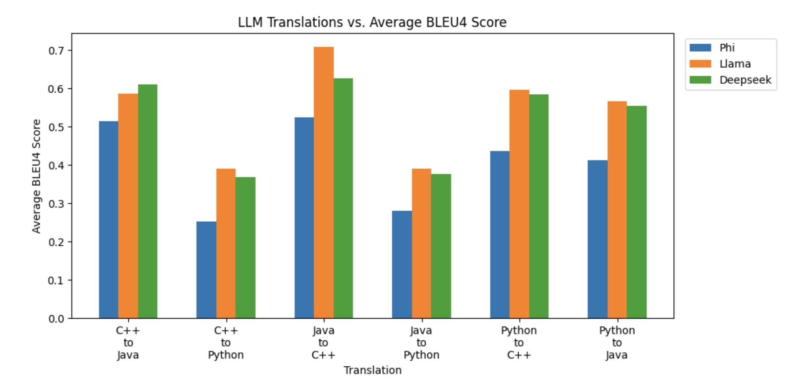
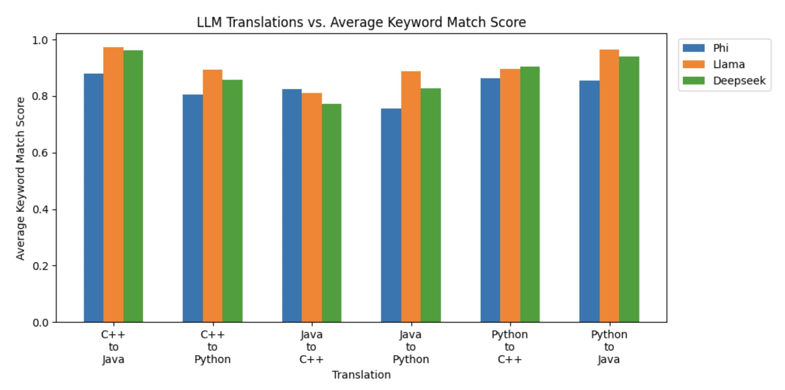
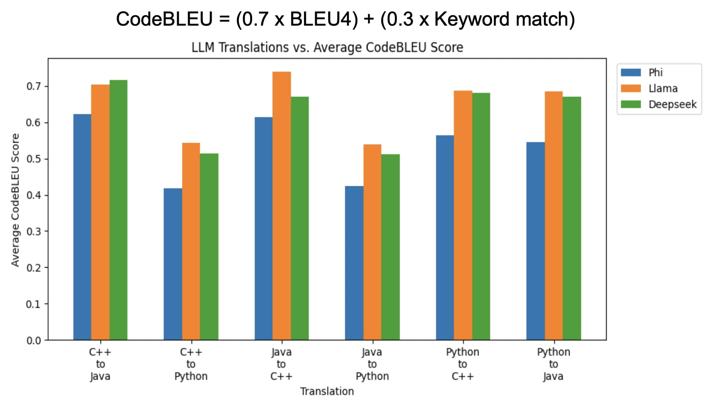

# CodeSynapse
by Manan Patel, Zachary Perry, Shayana Shreshta, Eric Vaughan

## Overview

This project looks to explore the capabilities of LLMs in cross-language code translation and its accuracy when translating across languages with different paradigms. In addition, we aim to build a tool that will allow developers to simply input code and translate it to a desired language using the LLM that is best at that specific translation.


## 🚀 Getting Started


### 📋 Prerequisites
Before you begin, make sure you have the following installed:
- **[Docker](https://www.docker.com/products/docker-desktop)**
  - Needed to run the containers for both the frontend + backend of the web app
- **[Go](https://golang.org/dl/)**
  - Required for building and running the backend code.
- **[Node.js](https://nodejs.org/en/download/)**
  - Required for building and running the frontend code.
- **[pnpm](https://pnpm.io/)**
  - Install with: `npm install -g pnpm` (or `brew install pnpm` for macOS).
- **[Ollama](https://ollama.com)**
    - Needed to run models locally (NOTE: this is pretty resource intensive so i recommend having ~16GB of RAM)

### ⚙️ Development Workflow + How to Run
To run the containers, you can utilize the provided shell script: `./run_dev.sh`
- This will build both the frontend + backend containers with `docker compose build dir_name`
- Then, it will run everything with `docker compose up`
- When interrupted with `ctrl+c`, it will tear down everything with `docker compose down`
- Please note that both the frontend and backend have hot reload enabled (vite, air), so there's no need to teardown everything when adding changes. Only time you will need to rebuild the container is if you install any new dependencies. 


### 🤖 Accessing & Running the LLMs
CodeSynapse has access to 4 models for translation:

| Model | Type | Requirements |
|-------|------|--------------|
| **GPT4o** | Cloud-based | Requires an OpenAI API key |
| **Llama 3.2:3B** | Cloud-based | Hosted for free on [Nvidia Build](https://build.nvidia.com) |
| **deepseek-coder:6.7B** | Local | Ran locally using Ollama |
| **phi:2.7B** | Local | Ran locally using Ollama |

#### API Configuration

Below is the required `.env` file needed to access both GPT4o and Llama 3.2 using this application:

```
# OpenAI API (for GPT4o)
OPEN_AI_KEY=your_openai_api_key_here

# Nvidia Build API (for Llama 3.2:3B)
NVIDIA_BUILD_API_KEY=your_nvidia_build_api_key_here

# URL for Nvidia Build
NVIDIA_LLAMA_URL=public url (i put it in the env file for no reason tbh)
```

**Note:** Both deepseek-coder:6.7B and phi:2.7B run locally using Ollama. You do not need to run these for the application to work. However, if you do not have API keys, this may be the best option. To install these via Ollama, please visit: 
- [deepseek-coder](https://ollama.com/library/deepseek-coder)
- [phi-2](https://ollama.com/library/phi:2.7b)

Additionally, when running these, you will need to add the local url to your .env file. This application is containerized so in order to access anything running locally outside of a container, you will need to use this address: 

```
# URL for locally running OLLAMA instance
OLLAMA_URL: http://host.docker.internal:PORTNUMBER/api/generate
```

## 📚 Project Results
For this study, we evaluated three  different LLMs: 
1. **Llama-3.2/3B**
2. **Deepseek-Coder/6.7B**
3. **Phi/2.7B**

*NOTE*: While the application does also use GPT4o, we did not evaluate that model as it would be quite expensive to do so.

### Dataset: 
We used the [XLCoST Dataset](), which provides hundreds of code samples for different programming problems in various langugaes. Here, we decided to focus on three languages: *Java*, *Python*, and *C++*. Additionally, we took 100 samples for each language and ended up having a 100 programming problems implemented in the three different languages.


### Methodology: 
Using the dataset, we evaluated each LLM by having it translate a shared set of code snippets between the three selected languages. We used the *CodeBleu*, *Bleu4*, and *keyword match* metrics to evaluate the translations. 

### Result: 

| BLEU4   | Keyword Match | CodeBLEU |
|---------|---------------|----------|
|  |  |  |

We found that overall, Llama 3.2 3B performed the best for almost all of the code translations tasks. However, Deepseek-Coder performed better for C++ to Java tasks. In the context of this study, we didn't find any correlation between model size and translation ability, as Llama 3.2 3B was much smaller than Deepseek-Coder 6.7B and mostly outperformed it. 

This leads us to believe that smaller LLMs are still capable of outperforming larger LLMs in the realm of code translation. 


